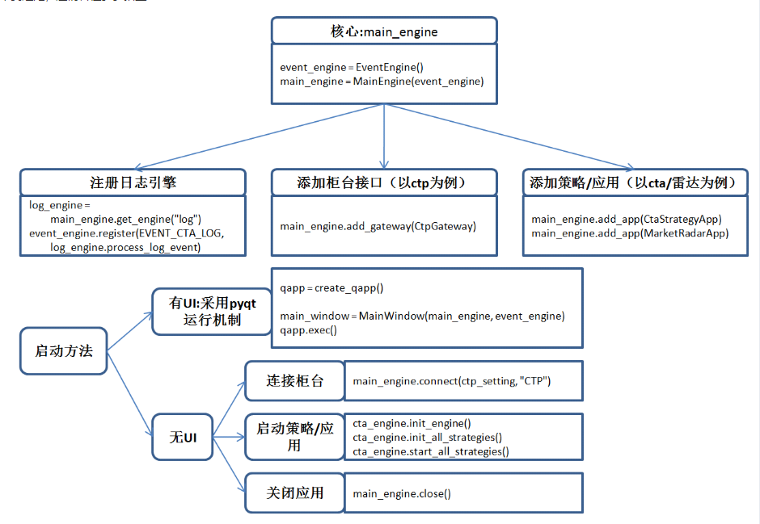

[TOC]

## 01VNP运行流程

> VNPY所有的交易应用中：
> 
> + 最核心的就是main_engine
> 
> + 插件部分包括交易接口的gateway和策略应用的app
> 
> + 无论UI模式，还是NO UI中的脚本启动，本质都是通过不同方法在调用main_engine提供的各种函数方法去执行对应的功能

## 02数据采集

+ 实现（期货为例）：vn.trader/dateRecorder
1. 通过单独的数据记录模板

2. 设置多个合约symbol，通过gateway.Subscrible()订阅行情

3. 注册tick到达事件，生成tick和bar数据，放入缓存

4. 另建线程，写入mongoDB

   

> 待完善
> 
> 1. 需要定期更新合约。 解决方法：通过行情接口获取所有合约
> 
> 2. 数据完整性校验。解决方法：多个行情接口+校验机制

+ [Database源码阅读笔记+配置教程 - 主题 - VeighNa量化社区 (vnpy.com)](https://www.vnpy.com/forum/topic/805-databaseyuan-ma-yue-du-bi-ji-+pei-zhi-jiao-cheng)